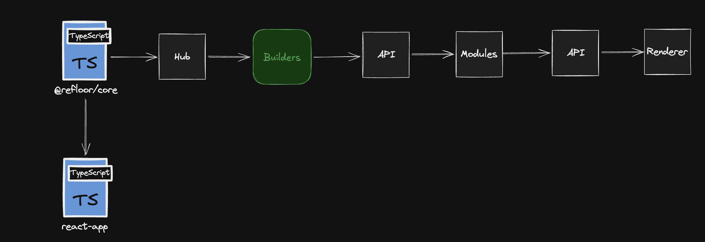

Интерактивная 3D-сцена комнаты с настройкой размеров помещения, визуализацией стен, пола, плинтуса и автоматическим расчётом материалов.

Проект реализован на **React**, **TypeScript** и **Three.js**.  
Основная 3D-логика вынесена в локальный пакет `@refloor/core`, а React-приложение отвечает за UI и взаимодействие с пользователем.

## Demo

GitHub Pages: https://a1unade.github.io/refloor-room-builder/

## Возможности

- построение 3D-комнаты по параметрам:  

  - длина;  
  
  - ширина;  
  
  - высота;  
  
- отображение стен с материалом покраски;  

- построение пола с отдельными плашками;  

- поддержка двух типов раскладки:  

  - прямая палубная раскладка;  
  
  - ёлочка / herringbone;  

- зазоры между досками;

- тепловой зазор между полом и стенами;  

- плинтус по периметру комнаты;  

- аккуратное примыкание плинтуса в углах;  

- расчёт количества плашек пола;  

- расчёт погонажа плинтуса;  

- управление камерой через OrbitControls;  

- адаптивная панель управления;  

- слайдеры для изменения параметров комнаты;  

- оптимизация пола через `InstancedMesh`.

## Технологии

- `React`  

- `TypeScript`  

- `Three.js`

- `Vite`

- `Fluent UI`

- `tsyringe`

- `GitHub Actions`

- `GitHub Pages`

## Основные допущения

- Единица измерения в 3D-сцене соответствует одному метру.  

- Размер плашки пола по умолчанию: 600 × 100 мм.  

- Толщина плашки используется только для визуализации.  

- Количество плашек рассчитывается по площади пола и площади одной плашки.  

- Для раскладки ёлочкой применяется повышающий коэффициент запаса.  

- Тепловой зазор у стен учитывается при генерации пола.  

- Плинтус визуально перекрывает тепловой зазор.

- Подрезка плашек у границ комнаты визуально ограничивается областью пола.  

- Расчёт погонажа плинтуса выполняется по периметру комнаты.  

- Расчёт краски не используется в итоговом UI, так как основной расчёт в текущей версии сфокусирован на напольном покрытии и плинтусе.

## Архитектура

В проекте используется разделение на React-приложение и 3D-ядро.

`@refloor/core` отвечает за:

- создание renderer;

- управление сценой;

- управление камерой и `OrbitControls`;

- построение стен;

- построение пола;

- построение плинтуса;

- расчёты материалов;

- публичный API через `AppHub`.

React-приложение отвечает за:

- canvas;

- панель управления;

- ввод параметров;

- отображение расчётов;

- обновление сцены при изменении параметров.

Такой подход позволяет отделить Three.js-логику от UI и упростить поддержку проекта.

